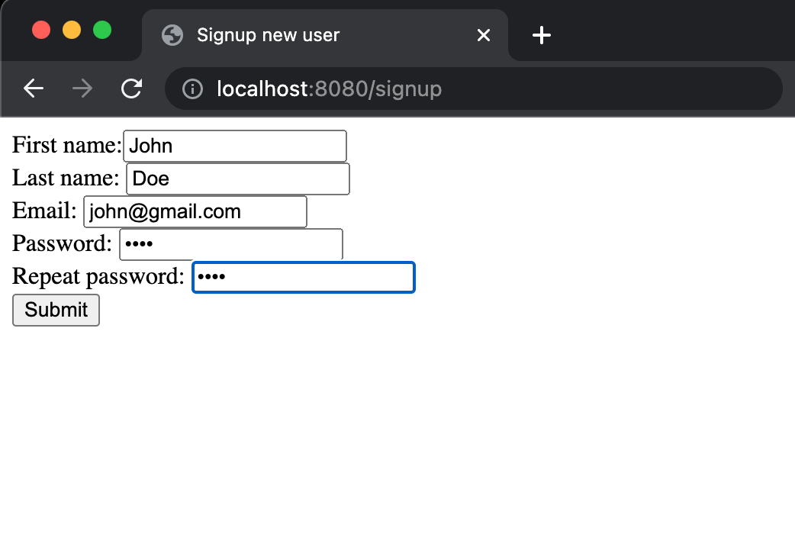

[//]: # (cat v0.md v3.md v2.md v1.md > README.md)
# A-Demo-WebApp-for-User-Data-Collection

## A demo Web Application to take user input from the end-users. Play with it, here in AWS (while it is live, for limited time) : http://44.201.181.113:8080

## How To Run ?

### This is inspired from [Spring-IO source](https://spring.io/guides/gs/rest-service/#scratch) and [Spring-IO rest-service](https://start.spring.io/)

Since we are using Maven, we can run the application by

(1) building the JAR file with

```shell
./mvnw clean package
````

(2) and then run the JAR file as:

```shell
java -jar target/UserDataCollection-0.0.1-SNAPSHOT.jar
```

(3) Now, enjoy

```sh
open:- http://localhost:8080/
```

---

## Setup JAVA (for the first time, typically on your cloud server such as AWS EC2 host)

If ```JAVA_HOME``` is not setup already, you might see errors like
```shell
Error: JAVA_HOME is not defined correctly.
  We cannot execute 
```

Install ```Java-11``` for this project. I am explaining here for ubuntu OS, follow similar process for your OS:
```shell
sudo apt install openjdk-11-jre-headless -y
```

This was sufficient for me (with Ubuntu OS). Kindly find/follow the standard ```JAVA``` setup process for your OS.

---

# v3 #

### Adding the diagrams in a bit ###

## Tech-Features ##

### This completes the Basic Requirements of the Task ###

1. Increased Fields for User Input
   1. Use can provide more input than provided at SignUp
2. Added ability for users to update 
3. Added security that every update request requires proof by providing credentials

## Potential for v4 ##

1. Add caching to DB layer
2. Add session management
3. Increase password sanitation and validation check
4. Store password securely and sensitively.
   1. Maybe just store hash (with salting) and not actual passwords in DB
5. Add more test cases.
# v2 #

1. New home/landing page that looks like
   this: </br>
2. You can directly go to ```SignIn``` or ```SignUp``` page from here.
3. Handling 4 use-cases successfully:
   1. ```USE_CASE_1```: Try to ```SignUp``` with an existing email
      1. behavior: can not
   2. ```USE_CASE_2```: Try to ```SignIn``` with an existing email
      1. behavior: Successful
   3. ```USE_CASE_3```: Try to ```SignUp``` with a new email
      1. behavior: Successful
   4. ```USE_CASE_4```: Try to ```SignIn``` with a new email
      1. behavior: can not

### ```USE_CASE_1``` ###
1. Let's try to ```SignUp``` with an existing email (```jon@doe```) : </br>
2. It doesn't let you SignUp with an already existing email in database: </br>

### ```USE_CASE_2``` ###
1. So now, ```SignIn``` using this existing email: </br>
2. ```SignIn``` is successful: </br>

### ```USE_CASE_3``` ###
1. Now, let's ```SignUp``` with a new email: </br>
2. ```SignUp``` is successful: </br>

### ```USE_CASE_4``` ###
1. Lastly,  let's try to ```SignIn``` using a new email: </br>
2. It does not let it: </br>


## Tech-Features ##

1. Added Junit Tests
2. Added Jacoco for measuring test coverage, with achieving 
   1. 100% lines/instructions coverage 
   2. 100% branch coverage
   3. for all Controllers: </br>
3. Added ```NoNull``` constraint on ```email``` column of DAO ```UserEntity```.
4. Added ```UniqueKey``` constraint on ```email``` column of DAO ```UserEntity```.
5. Added check that email can't be set empty while ```SingnUp```.
6. Handling 4 use-cases successfully:
   1. ```USE_CASE_1```: Try to ```SignUp``` with an existing email
      1. behavior: can not
   2. ```USE_CASE_2```: Try to ```SignIn``` with an existing email
      1. behavior: Successful
   3. ```USE_CASE_3```: Try to ```SignUp``` with a new email
      1. behavior: Successful
   4. ```USE_CASE_4```: Try to ```SignIn``` with a new email
      1. behavior: can not
7. Not checking password match for ```SignIn```
8. Not checking password sanity for ```SignUp```


## Potential for v3 ##

1. Increase Fields for User Input
2. Add ability for users to update once they ```SignIn```
3. Add caching to DB layer
4. Add session management
5. Increase password sanitation and validation check
6. Store password securely and sensitively.
   1. Maybe just store hash (with salting) and not actual passwords in DB
7. Add more test cases.
# v1 #

1. Added home/landing page that looks like
   this: </br>
2. Click to ```Signup``` for new user opens this signup
   page: </br>
3. Fill-up the details  (something like
   this): </br>
4. After filling up details, clicking the ```Submit``` button stores this as new user to database (with newly created
   usedId): </br>

## Tech-Features ##

1. Using Spring and MVC Concepts
    1. Model Objects
    2. View
    3. Controller Module
2. Connecting to an actual toy database with url: ```jdbc:mysql://sql9.freesqldatabase.com:3306/sql9580318```
3. Using JDBC
4. Added DAO layer
5. Using Hibernate
6. Added lombok
7. Added logging ```lombok.extern.slf4j.Slf4j```

## Potential for v2 ##

1. Throw error if existing email is used for new signup.
2. User should be able to edit the details via userId/email.
3. Maybe, add test cases ?
