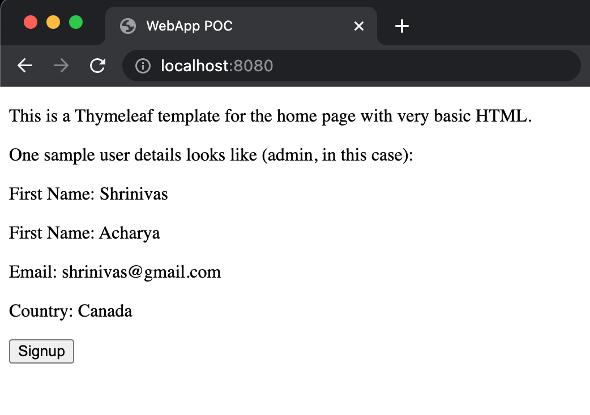
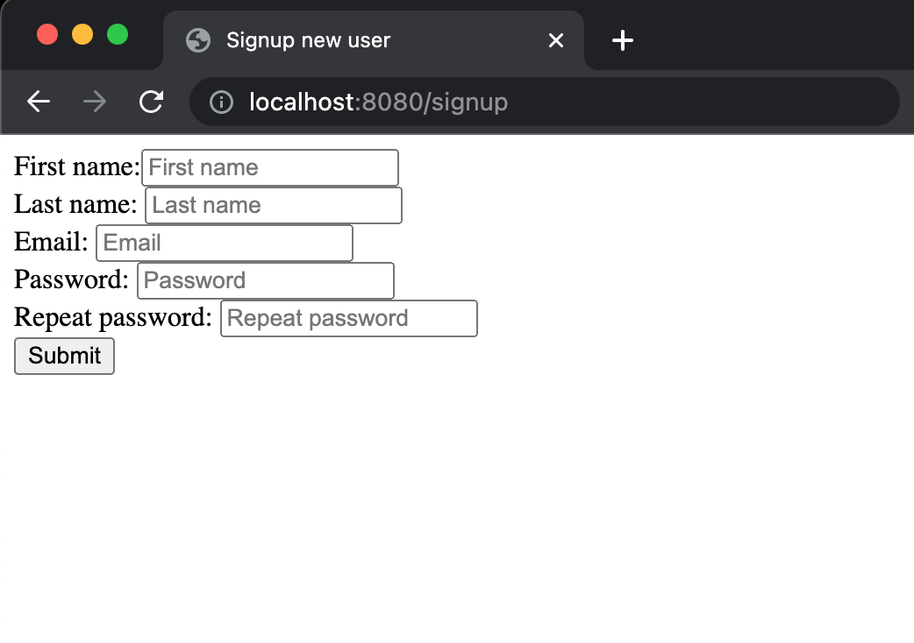
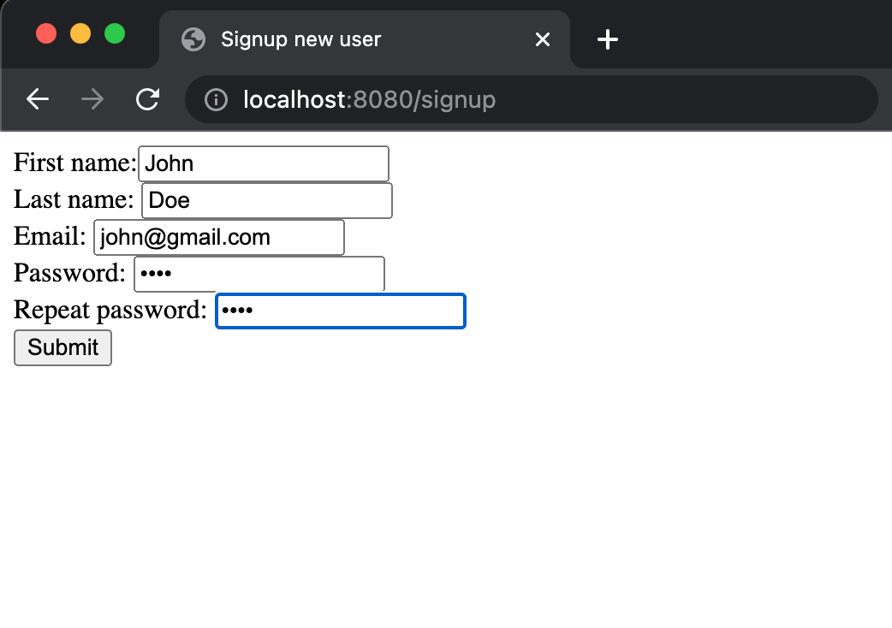
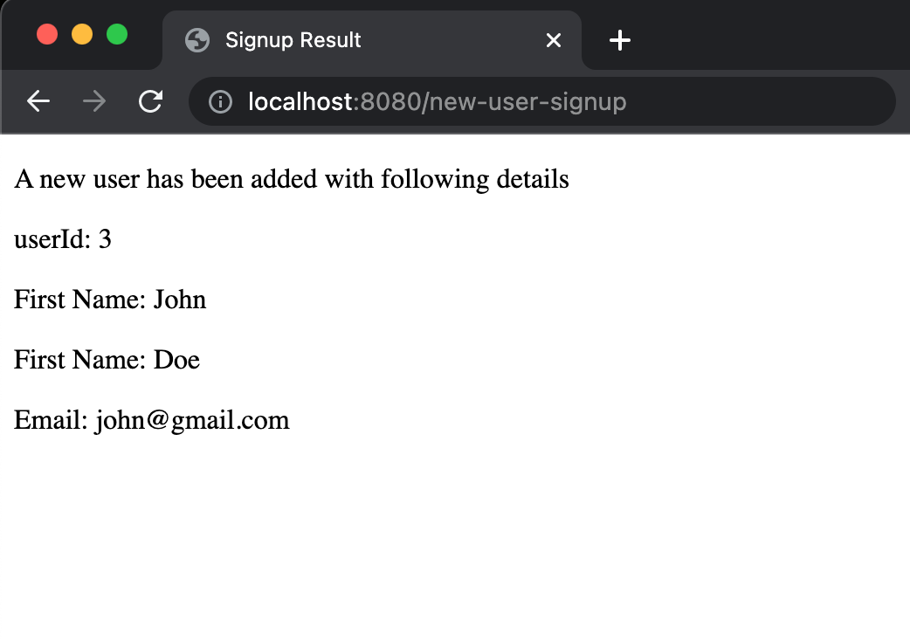

# v1 #

1. Added home/landing page that looks like
   this: </br>
2. Click to ```Signup``` for new user opens this signup
   page: </br>
3. Fill-up the details  (something like
   this): </br>
4. After filling up, submit button stores this as new user to database (with newly created
   usedId): </br>

## Tech-Features ##

1. Using Spring and MVC Concepts
    1. Model Objects
    2. View
    3. Controller Module
2. Connecting to an actual toy database with url: ```jdbc:mysql://sql9.freesqldatabase.com:3306/sql9580318```
3. Using JDBC
4. Added DAO layer
5. Using Hibernate
6. Added lombok
7. Added logging ```lombok.extern.slf4j.Slf4j```

## Potential for v2 ##

1. Throw error if existing email is used for new signup.
2. User should be able to edit the details via userId/email.
3. Maybe, add test cases ?
