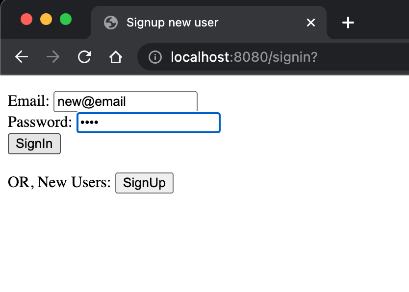
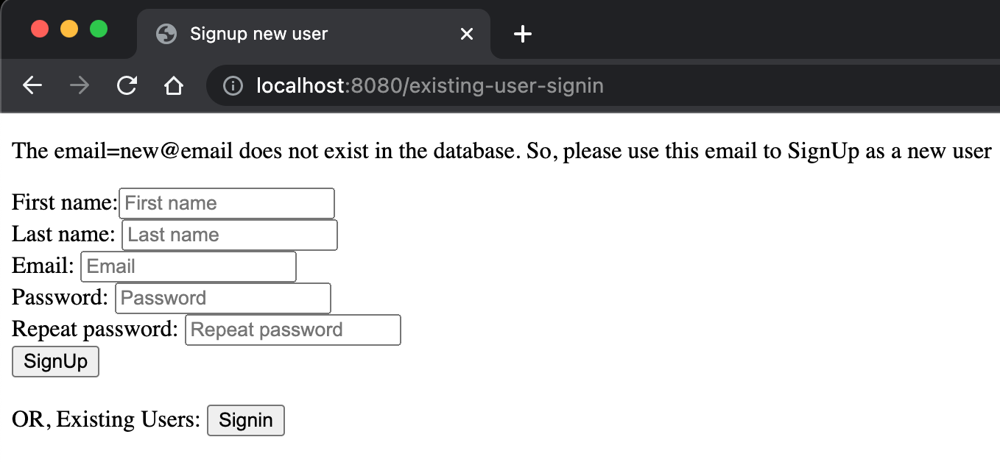

# v2 #

1. New home/landing page that looks like
   this: </br>
2. You can directly go to ```SignIn``` or ```SignUp``` page from here.
3. Handling 4 use-cases successfully:
   1. ```USE_CASE_1```: Try to ```SignUp``` with an existing email
      1. behavior: can not
   2. ```USE_CASE_2```: Try to ```SignIn``` with an existing email
      1. behavior: Successful
   3. ```USE_CASE_3```: Try to ```SignUp``` with a new email
      1. behavior: Successful
   4. ```USE_CASE_4```: Try to ```SignIn``` with a new email
      1. behavior: can not

### ```USE_CASE_1``` ###
1. Let's try to ```SignUp``` with an existing email (```jon@doe```) : </br>
2. It doesn't let you SignUp with an already existing email in database: </br>

### ```USE_CASE_2``` ###
1. So now, ```SignIn``` using this existing email: </br>
2. ```SignIn``` is successful: </br>

### ```USE_CASE_3``` ###
1. Now, let's ```SignUp``` with a new email: </br>
2. ```SignUp``` is successful: </br>

### ```USE_CASE_4``` ###
1. Lastly,  let's try to ```SignIn``` using a new email: </br>
2. It does not let it: </br>


## Tech-Features ##

1. Added Junit Tests
2. Added Jacoco for measuring test coverage, with achieving 
   1. 100% lines/instructions coverage 
   2. 100% branch coverage
   3. for all Controllers: </br>
3. Added ```NoNull``` constraint on ```email``` column of DAO ```UserEntity```.
4. Added ```UniqueKey``` constraint on ```email``` column of DAO ```UserEntity```.
5. Added check that email can't be set empty while ```SingnUp```.
6. Handling 4 use-cases successfully:
   1. ```USE_CASE_1```: Try to ```SignUp``` with an existing email
      1. behavior: can not
   2. ```USE_CASE_2```: Try to ```SignIn``` with an existing email
      1. behavior: Successful
   3. ```USE_CASE_3```: Try to ```SignUp``` with a new email
      1. behavior: Successful
   4. ```USE_CASE_4```: Try to ```SignIn``` with a new email
      1. behavior: can not
7. Not checking password match for ```SignIn```
8. Not checking password sanity for ```SignUp```


## Potential for v3 ##

1. Increase Fields for User Input
2. Add ability for users to update once they ```SignIn```
3. Add caching to DB layer
4. Add session management
5. Increase password sanitation and validation check
6. Store password securely and sensitively.
   1. Maybe just store hash (with salting) and not actual passwords in DB
7. Add more test cases.
